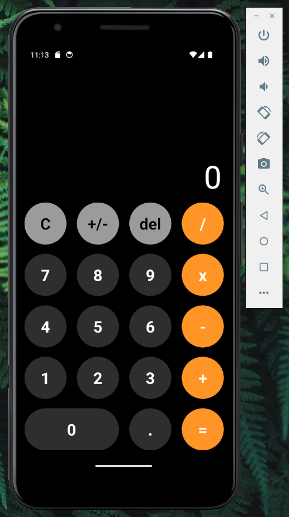

# **CALCULADORA IOS**

## **📌 OBJETIVOS**

- Desarrollar un clon de la calculadora del sistema operativo iOS 📱.

## **📌 DESCRIPCIÓN DEL PROYECTO**

Este proyecto tiene como objetivo construir un clon de la calculadora presente en el sistema operativo iOS. La calculadora clonada contendrá las siguientes características:

✅ Realizar operaciones matemáticas básicas.
 
✅ Funcionalidad para borrar los últimos números cargados.
 
✅ Funcionalidad para realizar un borrado total.

## **🦾 TECNOLOGÍAS**

- **HTML**, **CSS**, **React Native**, **Typescript**.

## **📍 IMÁGENES**

 

 
